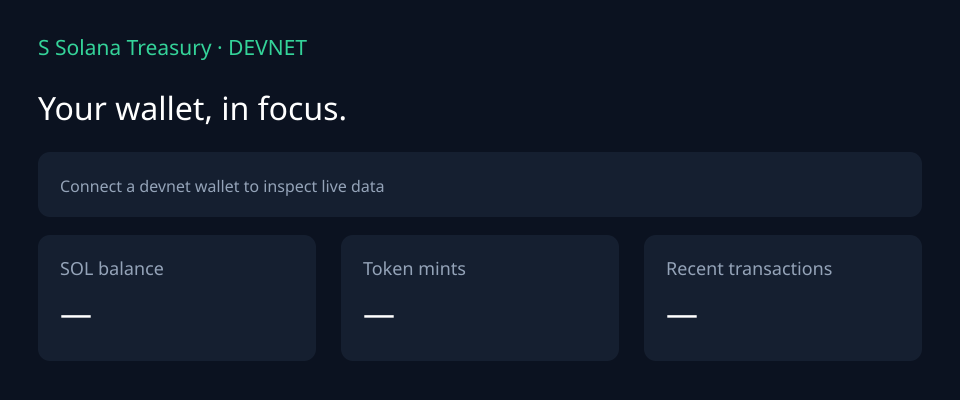

# Shim’s Solana Radar

A Solana wallet research project built for Shim’s interest in token markets and trading activity. This first version is a devnet wallet dashboard that reads real account state. Connect a wallet to inspect its SOL balance, nonzero SPL Token and Token-2022 balances, and the twelve latest transaction signatures. It also includes a personal SOL vault example for experimenting with an Anchor program on devnet.



## Run locally

Requires Node.js 20+ and a Solana browser wallet configured for **devnet**.

```bash
npm install
npm run dev
```

Open http://localhost:5173. Connect your wallet, or use the Solana devnet faucet to fund it. Optionally copy `.env.example` to `.env` and set `VITE_SOLANA_RPC_URL` to a dedicated **devnet** RPC URL if the public endpoint rate limits you. The frontend queries the endpoint directly; any key embedded in a Vite environment variable is visible to visitors.

The included Codama generated client is already checked in. Only run `npm run setup` if you modify the Rust program; doing so requires Rust, Solana CLI and Anchor CLI. Run `npm run build` for production and `npm run lint` for static checks.

## What I added

- Concurrent JSON-RPC calls for SOL balance, SPL Token accounts, Token-2022 accounts and recent signatures.
- Parsing and aggregation of multiple token accounts by mint, excluding zero balances.
- A dashboard for balances and activity, explorer links with explicit devnet cluster, refresh/error states and responsive layout.
- Read-only data flow: wallet connection is needed for the vault actions, but analytics only reads public account data.

The dashboard deliberately shows **token units**, not invented USD values or P&L. Realized P&L would require historical cost basis, transaction classification, price history and deposits/withdrawals. It does not identify Jupiter or Raydium positions yet. The public devnet RPC may rate limit calls; use your own devnet endpoint if needed. A wallet with no activity will display empty states.

## What came from the starter

Built from the [Solana Foundation React/Vite/Anchor template](https://github.com/solana-foundation/templates/tree/main/kit/react-vite-anchor), licensed MIT (see `LICENSE`). The original wallet connector, `VaultCard`, Anchor vault program, generated vault client, provider and build setup come from that template. The vault uses its **shared example program on devnet**; it is not independently deployed by this project. Do not deposit mainnet funds into an example vault. To deploy your own program, follow the [starter's deployment instructions](https://github.com/solana-foundation/templates/tree/main/kit/react-vite-anchor#deploy-your-own-vault) and replace the program ID.

## Technical map

| File | Purpose |
| --- | --- |
| `src/portfolio.ts` | Typed RPC client, token aggregation, cancelable React data loading |
| `src/App.tsx` | Wallet connection, balances, activity, explorer links |
| `src/providers.tsx` | Devnet wallet connector from original template |
| `src/VaultCard.tsx` | Original template's vault deposit/withdraw flow |
| `anchor/programs/vault` | Original Anchor example and its Rust tests |

### RPC methods

`getBalance`, `getTokenAccountsByOwner` (once for SPL Token and once for Token-2022), and `getSignaturesForAddress`. All queries use `confirmed` commitment. Transaction rows show signature status and time; they do not claim to decode swaps.

## Next milestones

1. Add transaction detail decoding and classifications for swaps/transfers, including Jupiter and Raydium routes.
2. Add a reliable pricing source and timestamped valuation history for SOL and SPL holdings, including PUMP where supported.
3. Build a separate cost-basis ledger before calculating P&L.

## License

MIT. Credit for the upstream starter belongs to the Solana Foundation and its contributors.
